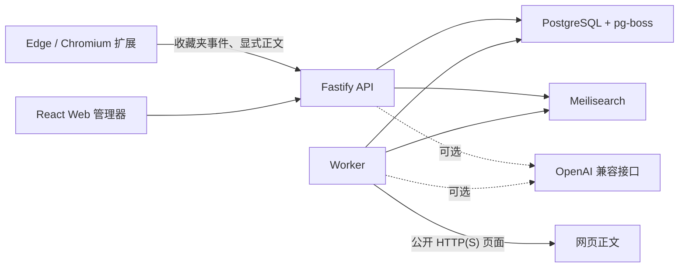

# Recalink

Recalink 是一个单用户、本地部署的 Edge/Chromium 书签管理器。它保留浏览器原收藏，在本地提取并索引网页正文，让你可以用“还记得的内容”找回已经忘记标题或收藏位置的网页。

> 当前状态：`0.1.0-alpha`。界面以简体中文为主，适合本地试用和开发验证，尚未提供账号系统或公网部署防护。

## 主要能力

- 导入 Edge 收藏夹，并持续接收新增、修改、移动和删除事件；
- 收藏当前网页前修改书签名称，同时保存已渲染页面的可读正文；
- 搜索标题、备注、标签、标题层级、正文、URL 和域名；
- 使用 PostgreSQL、pg-boss 和 Meilisearch 构成本地数据与检索服务；
- 可选使用 OpenAI 兼容接口进行查询扩展、候选重排和待确认标签建议；
- AI 未配置、超时或输出无效时自动退化为普通全文搜索；
- 使用 Docker Compose 部署，服务仅映射到 `127.0.0.1`。

## 工作方式



Edge 原生收藏仍是原始收藏来源；Recalink 的本地标题、备注和标签不会反写 Edge。从 Recalink 移除书签只写入本地墓碑，不会删除 Edge 收藏。

## 快速启动

要求：

- Docker Desktop；
- Node.js 24 和 npm（构建扩展与本地开发时需要）。

复制配置：

```powershell
Copy-Item .env.example .env
```

至少修改以下两个值：

```dotenv
EXTENSION_API_TOKEN=使用密码生成器创建的长随机字符串
MEILI_MASTER_KEY=另一个独立的长随机字符串
```

启动服务：

```powershell
docker compose up -d --build
docker compose ps
```

PostgreSQL、Meilisearch 和 API 显示 `healthy`，且 worker 显示 `running` 或 `up` 后，打开 <http://127.0.0.1:3210>。PostgreSQL 和 Meilisearch 不映射到宿主机或局域网。

## 安装 Edge 扩展

```powershell
npm ci
npm run build:extension
```

然后：

1. 打开 `edge://extensions`；
2. 开启“开发人员模式”；
3. 选择“加载解压缩的扩展”；
4. 选择 `apps\extension\.output\edge-mv3`；
5. 在扩展设置中填写 `http://127.0.0.1:3210` 和 `.env` 中的 `EXTENSION_API_TOKEN`；
6. 点击“保存并测试”，再点击“立即全量同步 Edge 收藏”。

后台同步只提交收藏夹结构、标题和 URL。只有用户明确点击“收藏当前网页并保存正文”时，扩展才读取当前页面的可读文本。

## 日常使用

- 使用扩展 popup 选择 Edge 文件夹、修改书签名称并收藏当前网页；
- 在 Web 管理器中按正文线索搜索，并使用标签、域名、时间和采集状态筛选；
- 在书签详情中编辑本地标题、备注和标签，或重新采集公开网页；
- 使用扩展 popup 快速搜索并打开前五个结果。

## 可选 AI 配置

AI 默认关闭。仅当以下三项都存在时启用：

```dotenv
AI_BASE_URL=https://provider.example/v1
AI_API_KEY=由所选服务商生成的密钥
AI_MODEL=所选服务商提供的模型标识
AI_TIMEOUT_MS=15000
```

配置后重新构建 API 和 worker：

```powershell
docker compose up -d --build api worker
```

模型会收到搜索查询与有限候选片段，或标签建议所需的有限正文摘录。模型密钥只存在于服务端环境变量中。完整说明见 [隐私说明](PRIVACY.md)。

## 开发与验证

```powershell
npm ci
npm run verify
npm audit --audit-level=low
```

Docker 合成烟雾测试不会读取真实 Edge 数据：

```powershell
docker compose up -d --build
docker compose exec -T api node --import tsx scripts/smoke-test.ts
```

搜索评估数据格式见 `fixtures/evaluation.sample.json`：

```powershell
npm run eval:search -- .\fixtures\evaluation.sample.json
```

## 项目结构

```text
apps/
  api/          Fastify API，并托管构建后的 Web
  worker/       pg-boss 正文采集、索引和标签建议任务
  web/          React/Vite 中文管理界面
  extension/    WXT Edge Manifest V3 扩展
packages/
  contracts/    Zod API 与 AI 数据契约
  core/         URL 规范化、正文提取、SSRF 防护和 RRF
  db/           Drizzle schema、PostgreSQL 连接与迁移
  server/       仓储、Meilisearch、队列和 AI 服务
```

## 安全与限制

- 服务端抓取仅允许 HTTP(S)，限制超时、重定向次数和响应大小；
- 每次 DNS 解析和重定向都会拒绝回环、私网、链路本地和云元数据地址；
- 正文最多保存 500,000 个字符；
- 第一版不包含多用户、移动端、截图/PDF 归档、向量检索、网页问答或自动应用 AI 标签；
- 动态页面和登录页面只在用户显式收藏时尝试从浏览器端采集，无法保证所有网站成功。

停止服务不会删除 named volumes：

```powershell
docker compose down
```

请勿添加 `-v`，除非你明确希望删除数据库和搜索数据。

## 项目文档

- [隐私说明](PRIVACY.md)
- [安全政策](SECURITY.md)
- [贡献指南](CONTRIBUTING.md)
- [变更记录](CHANGELOG.md)
- [行为准则](CODE_OF_CONDUCT.md)

Recalink 使用 [MIT License](LICENSE)。
