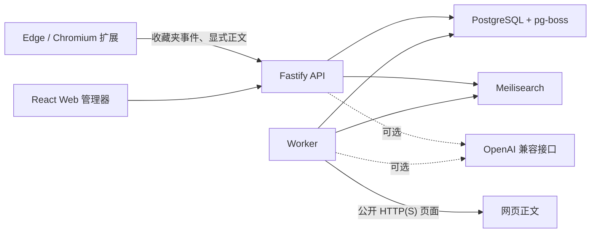

# Recalink Brand and Public Documentation Implementation Plan

> Historical plan: the smoke-test examples below have been superseded. Use `npm run smoke` as documented in the current [README](../../../README.md#开发与验证), which creates an isolated test database and volumes.

> **For agentic workers:** REQUIRED SUB-SKILL: Use superpowers:subagent-driven-development (recommended) or superpowers:executing-plans to implement this plan task-by-task. Steps use checkbox (`- [ ]`) syntax for tracking.

**Goal:** Rename the public product and workspace packages to Recalink and make the repository understandable, governable, and privacy-transparent as a local-first public Alpha.

**Architecture:** Change user-facing identity and internal npm scope together so builds cannot enter a half-renamed state. Preserve Docker/database names and extension runtime message names as compatibility identifiers, then document that boundary while replacing the public README and adding small focused governance files.

**Tech Stack:** npm workspaces, TypeScript, React/Vite, WXT, Docker Compose, Markdown, MIT License

---

## File map

- Modify: `package.json` and `package-lock.json` — root package and workspace dependency scope.
- Modify: all `apps/*/package.json` and `packages/*/package.json` files — `@recalink/*` workspace names.
- Modify: `tsconfig.base.json` and `vitest.config.ts` — TypeScript and Vitest aliases.
- Modify: TypeScript imports under `apps/api`, `apps/worker`, `packages/core`, and `packages/server` — new package scope.
- Modify: `Dockerfile` — build the renamed workspaces.
- Modify: `apps/web/index.html`, `apps/web/src/App.tsx`, `apps/web/src/App.test.tsx` — visible web brand.
- Modify: `apps/extension/wxt.config.ts`, popup/options HTML and React entrypoints, and `background.ts` — visible extension brand.
- Modify: `docs/superpowers/specs/2026-08-04-bookmark-title-before-save-design.md` — current product references.
- Replace: `README.md` — public Alpha overview and setup guide.
- Create: `LICENSE`, `PRIVACY.md`, `SECURITY.md`, `CONTRIBUTING.md`, `CHANGELOG.md`, `CODE_OF_CONDUCT.md`.

## Compatibility identifiers that must not be renamed

Keep these values unchanged in this plan:

- Docker Compose `name: bookmark-recall`;
- PostgreSQL database/user defaults beginning with `bookmark_recall`;
- the existing Meilisearch local default key;
- extension runtime messages `bookmark-recall:capture` and `bookmark-recall:full-sync`.

Changing the Compose project name would make existing named volumes appear missing. The message names are internal protocol identifiers, not user-facing identity. Their continued presence is intentional and must be mentioned in the final scan result.

### Task 1: Add a failing public-brand assertion

**Files:**

- Modify: `apps/web/src/App.test.tsx`

- [ ] **Step 1: Assert the Recalink brand in the existing web test**

Immediately after `render(<App />);`, add:

```typescript
expect(screen.getByRole("button", { name: "Recalink" })).toBeInTheDocument();
```

- [ ] **Step 2: Run the test and verify it fails**

Run:

```powershell
npx vitest run apps/web/src/App.test.tsx
```

Expected: FAIL because the current accessible brand name is `Bookmark Recall`.

### Task 2: Rename npm workspaces and code imports atomically

**Files:**

- Modify: `package.json`
- Modify: `package-lock.json`
- Modify: `apps/api/package.json`
- Modify: `apps/extension/package.json`
- Modify: `apps/web/package.json`
- Modify: `apps/worker/package.json`
- Modify: `packages/contracts/package.json`
- Modify: `packages/core/package.json`
- Modify: `packages/db/package.json`
- Modify: `packages/server/package.json`
- Modify: `tsconfig.base.json`
- Modify: `vitest.config.ts`
- Modify: `Dockerfile`
- Modify: every tracked TypeScript file that imports `@bookmark-recall/*`

- [ ] **Step 1: Apply the exact package-name mapping**

Use a single reviewed patch across the listed JSON, TypeScript, config, and Docker files:

```text
bookmark-recall                 -> recalink
@bookmark-recall/api            -> @recalink/api
@bookmark-recall/extension      -> @recalink/extension
@bookmark-recall/web            -> @recalink/web
@bookmark-recall/worker         -> @recalink/worker
@bookmark-recall/contracts      -> @recalink/contracts
@bookmark-recall/core           -> @recalink/core
@bookmark-recall/db             -> @recalink/db
@bookmark-recall/server         -> @recalink/server
```

Do not apply the bare `bookmark-recall -> recalink` replacement to `docker-compose.yml` or extension runtime message strings. In `package.json`, the relevant script block must become:

```json
{
  "dev:api": "npm run dev -w @recalink/api",
  "dev:worker": "npm run dev -w @recalink/worker",
  "dev:web": "npm run dev -w @recalink/web",
  "build:extension": "npm run build -w @recalink/extension",
  "db:migrate": "npm run migrate -w @recalink/db"
}
```

In `Dockerfile`, the build command must become:

```dockerfile
RUN npm run build --workspace @recalink/web \
 && npm run build --workspace @recalink/api \
 && npm run build --workspace @recalink/worker
```

- [ ] **Step 2: Regenerate the lockfile links**

Run:

```powershell
npm install --package-lock-only
```

Expected: `package-lock.json` contains `recalink` and `@recalink/*` workspace entries, with no dependency version changes unrelated to the workspace rename.

- [ ] **Step 3: Verify old package imports are gone**

Run:

```powershell
rg -n "@bookmark-recall/" package.json package-lock.json tsconfig.base.json vitest.config.ts Dockerfile apps packages
```

Expected: no output.

- [ ] **Step 4: Run typecheck**

Run:

```powershell
npm run typecheck
```

Expected: all workspaces resolve `@recalink/*` and exit 0.

- [ ] **Step 5: Commit the atomic package rename**

Run:

```powershell
git add package.json package-lock.json tsconfig.base.json vitest.config.ts Dockerfile apps packages
git commit -m "refactor: rename workspaces to Recalink"
```

Expected: one buildable commit containing package metadata, imports, aliases, and Docker build references.

### Task 3: Rename the visible Web and extension product

**Files:**

- Modify: `apps/web/index.html`
- Modify: `apps/web/src/App.tsx`
- Modify: `apps/web/src/App.test.tsx`
- Modify: `apps/extension/wxt.config.ts`
- Modify: `apps/extension/entrypoints/popup/index.html`
- Modify: `apps/extension/entrypoints/popup/main.tsx`
- Modify: `apps/extension/entrypoints/options/index.html`
- Modify: `apps/extension/entrypoints/options/main.tsx`
- Modify: `apps/extension/entrypoints/background.ts`
- Modify: `docs/superpowers/specs/2026-08-04-bookmark-title-before-save-design.md`

- [ ] **Step 1: Apply the user-facing string changes**

Make these exact changes:

```text
HTML title "Bookmark Recall"             -> "Recalink"
HTML title "Bookmark Recall 设置"        -> "Recalink 设置"
Web header "Bookmark Recall"             -> "Recalink"
Web removal confirmation                 -> "仅从 Recalink 中移除？Edge 原收藏不会被删除。"
Extension manifest name                  -> "Recalink"
Extension description                    -> "将 Edge 收藏同步到 Recalink，保存网页正文并快速检索。"
Popup/options brand text                 -> "Recalink"
Popup/options brand letter "B"           -> "R"
Background warning prefix                -> "Recalink 同步失败"
Current title-design references          -> "Recalink"
```

Leave `bookmark-recall:capture` and `bookmark-recall:full-sync` unchanged.

- [ ] **Step 2: Run the previously failing web test**

Run:

```powershell
npx vitest run apps/web/src/App.test.tsx
```

Expected: PASS, including the accessible Recalink brand assertion.

- [ ] **Step 3: Verify visible old-brand text is gone**

Run:

```powershell
rg -n "Bookmark Recall" apps README.md docs/superpowers/specs
```

Expected: no output after the README replacement in Task 4. At this intermediate step, output is allowed only from `README.md`.

- [ ] **Step 4: Commit the visible rename**

Run:

```powershell
git add apps/web apps/extension docs/superpowers/specs/2026-08-04-bookmark-title-before-save-design.md
git commit -m "refactor: rename product to Recalink"
```

Expected: one commit containing only user-facing brand changes and the already-approved design wording update.

### Task 4: Replace the README

**Files:**

- Replace: `README.md`

- [ ] **Step 1: Replace README with verified public-facing content**

Use this content:

````markdown
# Recalink

Recalink 是一个单用户、本地部署的 Edge/Chromium 书签管理器。它保留浏览器原收藏，在本地提取并索引网页正文，让你可以用“还记得的内容”找回已经忘记标题或收藏位置的网页。

> 当前状态：`0.1.0-alpha`。界面以简体中文为主，适合本地试用和开发验证，尚未提供账号系统或公网部署防护。

## 主要能力

- 导入 Edge 收藏夹，并持续接收新增、修改、移动和删除事件；
- 收藏当前网页前修改书签名称，同时保存已渲染页面的可读正文；
- 搜索标题、备注、标签、标题层级、正文、URL 和域名；
- 使用 PostgreSQL、pg-boss 和 Meilisearch 构成本地数据与检索服务；
- 可选使用 OpenAI 兼容接口进行查询扩展、候选重排和待确认标签建议；
- AI 未配置、超时或输出无效时自动退化为普通全文搜索；
- 使用 Docker Compose 部署，服务仅映射到 `127.0.0.1`。

## 工作方式



Edge 原生收藏仍是原始收藏来源；Recalink 的本地标题、备注和标签不会反写 Edge。从 Recalink 移除书签只写入本地墓碑，不会删除 Edge 收藏。

## 快速启动

要求：

- Docker Desktop；
- Node.js 24 和 npm（构建扩展与本地开发时需要）。

复制配置：

```powershell
Copy-Item .env.example .env
```

至少修改以下两个值：

```dotenv
EXTENSION_API_TOKEN=使用密码生成器创建的长随机字符串
MEILI_MASTER_KEY=另一个独立的长随机字符串
```

启动服务：

```powershell
docker compose up -d --build
docker compose ps
```

四个服务健康后打开 <http://127.0.0.1:3210>。PostgreSQL 和 Meilisearch 不映射到宿主机或局域网。

## 安装 Edge 扩展

```powershell
npm ci
npm run build:extension
```

然后：

1. 打开 `edge://extensions`；
2. 开启“开发人员模式”；
3. 选择“加载解压缩的扩展”；
4. 选择 `apps\extension\.output\edge-mv3`；
5. 在扩展设置中填写 `http://127.0.0.1:3210` 和 `.env` 中的 `EXTENSION_API_TOKEN`；
6. 点击“保存并测试”，再点击“立即全量同步 Edge 收藏”。

后台同步只提交收藏夹结构、标题和 URL。只有用户明确点击“收藏当前网页并保存正文”时，扩展才读取当前页面的可读文本。

## 日常使用

- 使用扩展 popup 选择 Edge 文件夹、修改书签名称并收藏当前网页；
- 在 Web 管理器中按正文线索搜索，并使用标签、域名、时间和采集状态筛选；
- 在书签详情中编辑本地标题、备注和标签，或重新采集公开网页；
- 使用扩展 popup 快速搜索并打开前五个结果。

## 可选 AI 配置

AI 默认关闭。仅当以下三项都存在时启用：

```dotenv
AI_BASE_URL=https://provider.example/v1
AI_API_KEY=由所选服务商生成的密钥
AI_MODEL=所选服务商提供的模型标识
AI_TIMEOUT_MS=15000
```

配置后重新构建 API 和 worker：

```powershell
docker compose up -d --build api worker
```

模型会收到搜索查询与有限候选片段，或标签建议所需的有限正文摘录。模型密钥只存在于服务端环境变量中。完整说明见 [隐私说明](PRIVACY.md)。

## 开发与验证

```powershell
npm ci
npm run verify
npm audit --audit-level=low
```

Docker 合成烟雾测试不会读取真实 Edge 数据：

```powershell
docker compose up -d --build
docker compose exec -T api node --import tsx scripts/smoke-test.ts
```

搜索评估数据格式见 `fixtures/evaluation.sample.json`：

```powershell
npm run eval:search -- .\fixtures\evaluation.sample.json
```

## 项目结构

```text
apps/
  api/          Fastify API，并托管构建后的 Web
  worker/       pg-boss 正文采集、索引和标签建议任务
  web/          React/Vite 中文管理界面
  extension/    WXT Edge Manifest V3 扩展
packages/
  contracts/    Zod API 与 AI 数据契约
  core/         URL 规范化、正文提取、SSRF 防护和 RRF
  db/           Drizzle schema、PostgreSQL 连接与迁移
  server/       仓储、Meilisearch、队列和 AI 服务
```

## 安全与限制

- 服务端抓取仅允许 HTTP(S)，限制超时、重定向次数和响应大小；
- 每次 DNS 解析和重定向都会拒绝回环、私网、链路本地和云元数据地址；
- 正文最多保存 500,000 个字符；
- 第一版不包含多用户、移动端、截图/PDF 归档、向量检索、网页问答或自动应用 AI 标签；
- 动态页面和登录页面只在用户显式收藏时尝试从浏览器端采集，无法保证所有网站成功。

停止服务不会删除 named volumes：

```powershell
docker compose down
```

请勿添加 `-v`，除非你明确希望删除数据库和搜索数据。

## 项目文档

- [隐私说明](PRIVACY.md)
- [安全政策](SECURITY.md)
- [贡献指南](CONTRIBUTING.md)
- [变更记录](CHANGELOG.md)
- [行为准则](CODE_OF_CONDUCT.md)

Recalink 使用 [MIT License](LICENSE)。
````

- [ ] **Step 2: Check README commands and paths**

Run:

```powershell
rg -n "C:\\|Bookmark Recall|@qq\.com" README.md
```

Expected: no output.

### Task 5: Add license, privacy, security, contribution, change, and conduct files

**Files:**

- Create: `LICENSE`
- Create: `PRIVACY.md`
- Create: `SECURITY.md`
- Create: `CONTRIBUTING.md`
- Create: `CHANGELOG.md`
- Create: `CODE_OF_CONDUCT.md`

- [ ] **Step 1: Add the MIT license**

Create `LICENSE`:

```text
MIT License

Copyright (c) 2026 qwqqaq0

Permission is hereby granted, free of charge, to any person obtaining a copy
of this software and associated documentation files (the "Software"), to deal
in the Software without restriction, including without limitation the rights
to use, copy, modify, merge, publish, distribute, sublicense, and/or sell
copies of the Software, and to permit persons to whom the Software is
furnished to do so, subject to the following conditions:

The above copyright notice and this permission notice shall be included in all
copies or substantial portions of the Software.

THE SOFTWARE IS PROVIDED "AS IS", WITHOUT WARRANTY OF ANY KIND, EXPRESS OR
IMPLIED, INCLUDING BUT NOT LIMITED TO THE WARRANTIES OF MERCHANTABILITY,
FITNESS FOR A PARTICULAR PURPOSE AND NONINFRINGEMENT. IN NO EVENT SHALL THE
AUTHORS OR COPYRIGHT HOLDERS BE LIABLE FOR ANY CLAIM, DAMAGES OR OTHER
LIABILITY, WHETHER IN AN ACTION OF CONTRACT, TORT OR OTHERWISE, ARISING FROM,
OUT OF OR IN CONNECTION WITH THE SOFTWARE OR THE USE OR OTHER DEALINGS IN THE
SOFTWARE.
```

- [ ] **Step 2: Add the privacy explanation**

Create `PRIVACY.md`:

```markdown
# Recalink 隐私说明

Recalink `0.1.0-alpha` 是单用户、本地部署的软件，默认不提供遥测、广告、账号系统或第三方分析。

## 本地保存的数据

PostgreSQL 保存书签 URL、标题、文件夹来源、用户备注、标签、采集状态和提取后的纯文本正文。Meilisearch 保存用于检索的对应索引。数据位于本机 Docker named volumes 中。

## Edge 扩展

- `bookmarks`：首次导入收藏树，并监听收藏新增、修改、移动和删除；
- `storage`：在浏览器本地保存 API 地址、扩展令牌和默认收藏文件夹；
- `activeTab`：仅在用户操作当前页面时读取页面地址、标题和显式采集所需内容；
- 本地主机访问权限：连接 `http://127.0.0.1` 或 `http://localhost` 上的 Recalink API。

后台同步只上传收藏夹结构、标题和 URL。只有用户点击“收藏当前网页并保存正文”时，扩展才从当前页面提取可读纯文本、标题层级、描述和语言。表单控件、脚本和完整 DOM 不会作为采集载荷保存。

扩展令牌保存在 `chrome.storage.local`，并通过 Bearer 请求发送到用户配置的 Recalink API。它不会写入数据库。

## 服务端网页采集

Edge 原生新增公开 HTTP(S) 收藏后，worker 可能在不使用浏览器登录状态的情况下请求网页。服务端拒绝回环、私网、链路本地和云元数据地址，并限制超时、重定向、响应体和正文长度。

## 可选 AI

AI 默认关闭。配置 OpenAI 兼容接口后：

- AI 搜索可能发送查询、候选标题、域名和命中片段；
- AI 标签建议可能发送标签档案和有限正文摘录；
- API 密钥只从服务端环境变量读取；
- AI 返回的新标签未经用户确认不会成为正式标签。

数据如何被 AI 服务商处理取决于用户选择的服务商及其政策。处理敏感书签前，应先确认服务商的数据保留和训练设置。

## 删除数据

在 Recalink 中移除书签不会删除 Edge 原收藏。删除 Docker volumes 会删除本地数据库与搜索索引，且无法由 Recalink 恢复。
```

- [ ] **Step 3: Add the security policy**

Create `SECURITY.md`:

```markdown
# 安全政策

## 支持范围

安全修复优先面向默认分支上的最新 `0.1.x-alpha` 代码。Recalink 当前只按单用户、本机部署场景设计，不应直接暴露到公网。

## 报告安全问题

公开仓库建立后，请使用 GitHub 仓库 Security 页面中的私密漏洞报告功能。请不要在公开 Issue 中发布令牌、真实书签、正文、数据库导出或可直接利用的细节。

报告应包含受影响版本、复现条件、实际影响和不含私人数据的最小复现。维护者确认问题前，请避免公开利用细节。

## 安全边界

- API 默认只绑定 `127.0.0.1`；
- PostgreSQL 和 Meilisearch 不映射到宿主机；
- 服务端抓取包含 DNS 与重定向阶段的 SSRF 检查；
- 扩展令牌不是多用户登录系统；
- 登录页面正文只在用户显式点击扩展收藏时读取；
- 用户配置的第三方 AI 服务不属于 Recalink 的信任边界。
```

- [ ] **Step 4: Add the contribution guide**

Create `CONTRIBUTING.md`:

````markdown
# 贡献指南

感谢你改进 Recalink。当前项目处于本地单用户 Alpha，请优先提交范围清晰、可测试且不扩大数据收集面的改动。

## 开发环境

- Node.js 24
- npm
- Docker Desktop

```powershell
npm ci
Copy-Item .env.example .env
npm run verify
```

涉及数据库、检索或队列时，再启动 Docker 服务并运行合成烟雾测试：

```powershell
docker compose up -d --build
docker compose exec -T api node --import tsx scripts/smoke-test.ts
```

## 提交要求

- 功能和缺陷修复先添加能失败的测试；
- 不提交 `.env`、令牌、AI 密钥、真实收藏、网页正文或数据库导出；
- 不增加扩展权限，除非 PR 明确说明用途、风险和更小权限方案；
- 更新用户可见行为时同步 README、隐私说明或变更记录；
- 提交前运行 `npm run verify`。

提交信息建议使用 `feat:`、`fix:`、`docs:`、`test:`、`refactor:` 或 `chore:` 前缀。
````

- [ ] **Step 5: Add the changelog**

Create `CHANGELOG.md`:

```markdown
# 变更记录

本项目采用 [Keep a Changelog](https://keepachangelog.com/zh-CN/1.1.0/) 的结构，并计划在稳定发布后遵循语义化版本。

## [Unreleased]

### Added

- 收藏当前网页前可修改书签名称。
- Recalink 公开 Alpha 文档、基础仓库治理和持续集成。

### Changed

- 产品展示名和 npm workspace 作用域改为 Recalink。
- 浏览器扩展使用 Recalink 图标并收紧未使用权限。

## [0.1.0-alpha] - 2026-08-05

### Added

- Edge/Chromium 收藏夹首次导入与单向事件同步。
- 显式正文采集、服务端公开网页采集与元数据降级。
- PostgreSQL、pg-boss、Meilisearch 全文检索和命中片段。
- 中文 Web 管理器、扩展快速搜索、标题/备注/标签管理。
- 可选 AI 查询扩展、候选重排和待确认标签建议。
- 合成烟雾测试与 Hit@1、Hit@5、Hit@10 搜索评估脚本。
```

- [ ] **Step 6: Add a concise conduct policy**

Create `CODE_OF_CONDUCT.md`:

```markdown
# 行为准则

参与 Recalink 社区时，请保持尊重、耐心和建设性。

可接受的行为包括：围绕事实讨论技术问题、善意解释不同观点、保护他人隐私，以及在犯错后及时修正。

不可接受的行为包括：骚扰、歧视、人身攻击、未经允许公开私人信息，以及故意发布令牌、书签正文或其他敏感数据。

维护者可以编辑、隐藏或拒绝违反本准则的 Issue、评论和贡献，并可限制持续违规者的参与。严重问题请通过仓库的私密安全报告渠道联系维护者。

本准则参考 [Contributor Covenant 2.1](https://www.contributor-covenant.org/version/2/1/code_of_conduct/)。
```

- [ ] **Step 7: Format and scan the public documents**

Run:

```powershell
npx prettier --check README.md PRIVACY.md SECURITY.md CONTRIBUTING.md CHANGELOG.md CODE_OF_CONDUCT.md
rg -n "C:\\|@qq\.com|Bookmark Recall" README.md PRIVACY.md SECURITY.md CONTRIBUTING.md CHANGELOG.md CODE_OF_CONDUCT.md LICENSE
```

Expected: Prettier passes and the scan prints no matches.

- [ ] **Step 8: Commit public documentation**

Run:

```powershell
git add README.md LICENSE PRIVACY.md SECURITY.md CONTRIBUTING.md CHANGELOG.md CODE_OF_CONDUCT.md
git commit -m "docs: prepare Recalink public alpha"
```

Expected: one documentation-only commit.

### Task 6: Verify the rename and compatibility boundary

**Files:**

- Verify: all tracked files

- [ ] **Step 1: Run the full verification**

Run:

```powershell
npm run verify
```

Expected: format, lint, typecheck, tests, and builds pass under `@recalink/*` names.

- [ ] **Step 2: Classify all remaining old identifiers**

Run:

```powershell
rg -n --hidden -g "!node_modules" -g "!dist" -g "!.output" -g "!.git" "bookmark-recall|Bookmark Recall" .
```

Expected matches are limited to:

- `docker-compose.yml` compatibility project/database/key names;
- `.env.example` database/key compatibility defaults;
- `bookmark-recall:capture` and `bookmark-recall:full-sync` runtime messages;
- historical design text that explicitly describes the former working name;
- plan documents describing the rename and compatibility decision.

Any other match must be renamed or explicitly justified before proceeding.

- [ ] **Step 3: Confirm package metadata**

Run:

```powershell
npm pkg get name
npm query .workspace | Select-String "@recalink/"
```

Expected: root name `recalink` and all eight workspaces use the `@recalink/*` scope.

- [ ] **Step 4: Confirm the working tree is clean**

Run:

```powershell
git status --short
```

Expected: no output.
